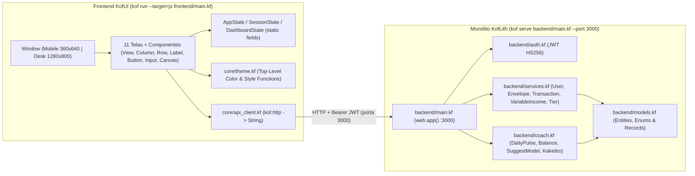

# Design: MVP 1 KofLith Full-Stack & Design System Triad (Desk + Mobile)

**Feature**: `mvp1-koflith-attack`
**Spec**: `.specs/features/mvp1-koflith-attack/spec.md`
**Design System Artifacts**:
- **Design System:** [https://claude.ai/artifact/JVjueTmHeJsnHLsow3LDVb](https://claude.ai/artifact/JVjueTmHeJsnHLsow3LDVb)
- **Desktop:** [https://claude.ai/artifact/64FYjX5UiveVxTtRGYurQP](https://claude.ai/artifact/64FYjX5UiveVxTtRGYurQP)
- **Mobile:** [https://claude.ai/artifact/8b3jFV4BrGj4YkDQAwDvDF](https://claude.ai/artifact/8b3jFV4BrGj4YkDQAwDvDF)

---

## 1. Arquitetura Unificada KofLith (`backend/` + `frontend/`)



---

## 2. Decisões Técnicas Baseadas no Corpus `Kof4j/training/`

### 2.1. Firewall Anti-Alucinação KOF (`training/anti-patterns/fake-idioms.md` & `learn/35-kof-ui.md`)
| Conceito | ❌ Proibido (Alucinação Comum) | ✅ Padrão Oficial `Kof4j/training/` |
|---|---|---|
| Declaração de função | `fun foo()`, `fn foo()`, `foo() -> String {}` | `String foo(Int a) { ... }` ou `foo(Int a): String { ... }` |
| Acesso a `List<T>` | `lista[0]` (Erro `SEM054` no Kof 0.4.x) | `lista.get(0)` |
| Iteração `for` | `for (x in xs)` (sem `var`) | `for (var x in xs) { ... }` |
| Inicialização nula | `String s = null` (Erro `SEM048`) | `String? s = null` (com narrowing `if (s != null)`) |
| Estado de UI em Lambdas | `var count = 0` mutado dentro de `() -> {}` | `class AppState { static Int count = 0 }` |
| Cores Estáticas no KofJS | `AppTheme.bgPrimary` (undefined no `Default.mjs`) | Funções top-level: `Color colorBgPrimary() = Color(10, 13, 24)` |
| Navegação entre telas | `Router.go()`, `Router.push()`, `Component()` | `AppState.currentScreen = "..."` + `window.bind(buildActiveScreen(window))` |
| HTTP Client (`kof.http`) | `resp.body`, `resp.status`, `headers: {...}` | `String body = http.post(url, payload, "Authorization: Bearer " + tok)` |
| Exceções | `catch (Exception e)` | `throw "Erro"` / `catch (String e)` |
| Segurança (`kof.security`) | `sha256(pwd)`, `tok1 == tok2` | `passwords.hash(pwd)`, `security.constantTimeEquals(a, b)` |

### 2.2. Dual Viewport: Mobile (`360×640`) & Desktop (`1280×800`)
- **Mobile (`8b3jFV4BrGj4YkDQAwDvDF`)**: Layout vertical `360×640` com `StatusBar` superior, conteúdo central em `Column` e `NavBar` inferior fixa (`Dashboard`, `Chat`, `Caixinhas`).
- **Desktop (`64FYjX5UiveVxTtRGYurQP`)**: Layout horizontal `1280×800` usando `Row(listOf(sidebarView, mainContentView, rightCoachPanelView))`, permitindo alternar em tempo real entre o modo Mobile (`360×640`) e o modo Desktop (`1280×800`) através de um seletor no topo (`AppState.isDesktop`), compartilhando exatamente os mesmos builders de componentes e o mesmo estado reativo!

### 2.3. Árvore Modular de Arquivos (`frontend/`)
```text
frontend/
  main.kf                         # Entrypoint Window + Dispatcher Mobile/Desktop
  core/
    theme.kf                      # Funções top-level de Color e Style (Design System JVjueTmHeJsnHLsow3LDVb)
    app_state.kf                  # Classes estáticas: AppState, SessionState, OnboardingState, DashboardState, ChatState
    api_client.kf                 # Integração HTTP com KofLith (:3000) + parsers de String/JSON
  components/
    brand_header.kf               # Logomark 3 ondas (via Canvas) + cabeçalhos alinhados + toggle Mobile/Desk
    nav_bar.kf                    # Navegação inferior (Mobile) e Sidebar (Desktop)
    pulse_card.kf                 # Card de Pulso Diário + dica de economia
    pie_chart.kf                  # Gráfico de Pizza 200x200 via Canvas 2D (3 fatias + estados normal/alerta/perigo)
    envelope_card.kf              # Card de caixinha com chip colorido por categoria + barra de progresso
    chat_bubble.kf                # Bolhas de chat (IA #1A1F3A à esquerda, Usuário #00D4FF à direita)
    notification_toast.kf         # Pop-up de notificação push (5 modelos do catálogo da Tela 11)
  screens/
    auth_screens.kf               # Telas 1 (Boas-vindas), 2 (Login) e 3 (Cadastro)
    onboarding_screens.kf         # Telas 4 (Salário), 5 (Renda), 6 (Dívidas), 6.1 (Valor da Dívida) e 7 (Resultado)
    dashboard_screen.kf           # Tela 8 (Dashboard Mobile + Visão Expandida Desktop)
    chat_screen.kf                # Tela 9 (AI Coach Conversacional conectado a /api/chat/message)
    envelopes_screen.kf           # Tela 10 (Caixinhas agrupadas por Bucket + modal Tela 11 Notificação)
```
