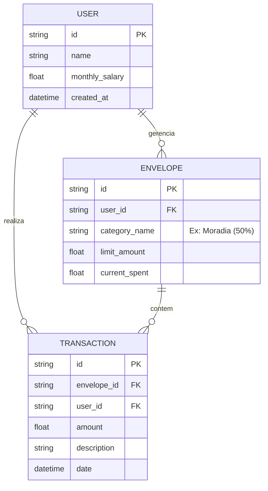

# Organiza IA

**O unico app de financas que conversa com voce, entende seu salario e te diz o que fazer hoje.**

Organiza IA e um organizador de gastos inteligente projetado para separar as financas de uma pessoa com base no salario que ela ganha. Ao contrario de agregadores passivos de mercado, ele atua como um coach financeiro proativo.

---

## Diferenciais

**Abordagem Hibrida** -- combina a simplicidade da regra 50/30/20 com a personalizacao do metodo de Envelopes. O sistema sugere a divisao inicial, mas permite que o usuario crie tetos de gastos personalizados dentro de cada bucket.

**Coach Financeiro com IA** -- a IA classifica os gastos automaticamente nos buckets corretos, alerta sobre a proximidade dos limites e gera insights acionaveis para orientar o futuro financeiro do usuario. Nao mostra so o que voce gastou; diz o que fazer com o dinheiro que voce tem hoje.

**Zero Barreira de Entrada** -- nao exige conexao bancaria (Open Finance), eliminando o atrito e o receio de compartilhamento de dados. A entrada e ativa e simplificada, podendo ser feita de forma manual ou por comandos de voz.

## Stack

| Camada | Tecnologia |
|---|---|
| Front-end | KOF (kof.ui) -- linguagem compilada para JVM, renderiza via KofJS em webview |
| Back-end (BFF) | KOF (kof.web) -- servidor HTTP desacoplado, servindo dados estruturados para o front-end |
| Back-end (API) | Java 17, Spring Boot 3.3.x, Spring AI (GPT-4o-mini via tool calling) |
| Banco de Dados | MySQL no Render (modelo relacional) com cronjob de ping para estabilidade continua |
| Build | Gradle (backend), kof-cli (frontend/BFF) |

## Arquitetura

```
┌─────────────────────────┐     ┌─────────────────────────┐     ┌─────────────────────────┐
│  KOF Frontend (kof.ui)  │     │  KOF BFF (kof.web)      │     │  Spring Boot (Backend)  │
│                         │     │                         │     │                         │
│  Telas e componentes    │────>│  Proxy autenticado      │────>│  Logica de negocio      │
│  compilados para JVM    │ JWT │  Rotas desacopladas     │ HTTP│  Spring AI (coach IA)   │
│  Renderiza via webview  │     │  Servidor HTTP na JVM   │     │  MySQL (Render)         │
└─────────────────────────┘     └─────────────────────────┘     └─────────────────────────┘
```

## Modelo de Negocio

| Tier | Preco | Inclui |
|---|---|---|
| Free | R$0 | Chat com IA (30 msgs/mes), pulso diario, 3 envelopes |
| Premium | R$9,90/mes | Chat ilimitado, voz, insights semanais, simulador, envelopes ilimitados |

## Modelagem de Dados



## Roadmap

| Fase | Foco | Entregavel |
|---|---|---|
| **1 -- Design** | Modelagem visual (Mermaid.js), aprovacao de fluxo | Diagramas ER e de fluxo validados |
| **2 -- Desenvolvimento** | Implementacao full-stack (KOF + Spring Boot) | MVP funcional: chat + pulso diario + envelopes |
| **3 -- Code Review** | PRs rigorosos para a comunidade open source | Produto estavel com contribuicoes externas |

## Como Contribuir

Veja [CONTRIBUTING.md](CONTRIBUTING.md) para o guia completo de setup, padroes de codigo e fluxo de PR.

## Tecnologia

O Organiza IA e o primeiro app de referencia da linguagem **KOF** -- uma linguagem de programacao geral, fortemente tipada e compilada para JVM, criada pela [Melissa (KofLang)](https://github.com/KofLang/Kof4j). Usamos KOF tanto no front-end (kof.ui) quanto no BFF (kof.web), eliminando Node.js e Flutter do stack e unificando tudo na JVM.

## Licenca

MIT License. Veja [LICENSE](LICENSE).
