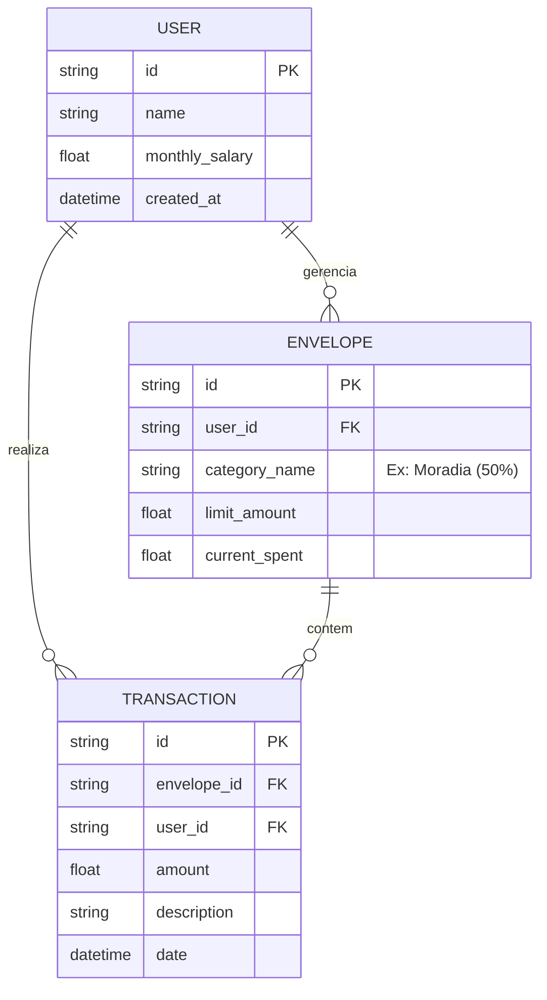
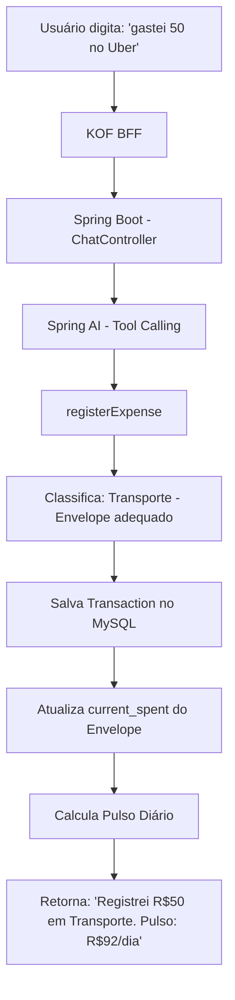
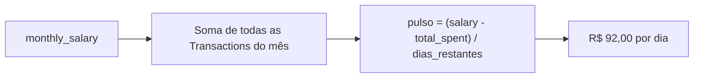
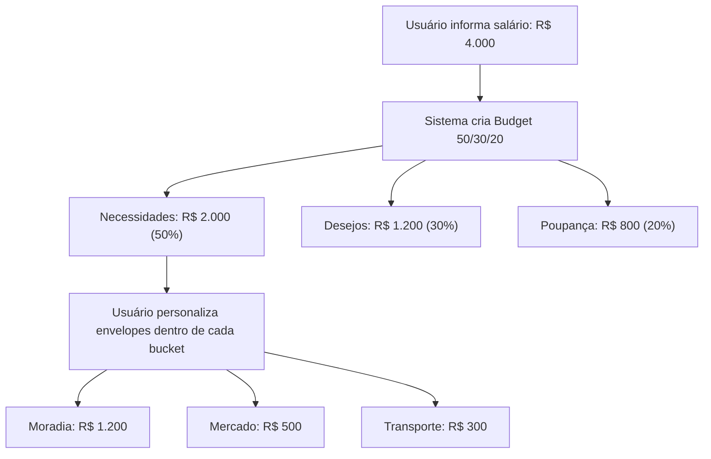

# Modelagem de Dados -- Organiza IA

## Decisões de simplificação

O modelo foi desenhado para facilitar a adoção pelo KOF e permitir que qualquer contribuidor entenda visualmente como os dados se relacionam no banco hospedado no Render.

Três entidades cobrem todo o domínio:

- **USER** é o centro. Tem salário mensal, que é a base de cálculo para tudo.
- **ENVELOPE** pertence ao User e representa um teto de gastos por categoria (ex: "Moradia -- 50%"). O campo `current_spent` é desnormalizado propositadamente para consulta rápida sem precisar agregar transações a cada request.
- **TRANSACTION** pertence ao User e opcionalmente a um Envelope. É o registro de cada gasto ou receita.

A simplicidade é intencional: um dev que olha o diagrama entende o sistema inteiro em 30 segundos.

---

## ER Diagram

---

## Fluxo principal: registro de gasto via chat

## Fluxo: cálculo do pulso diário

## Fluxo: criação automática de envelopes

