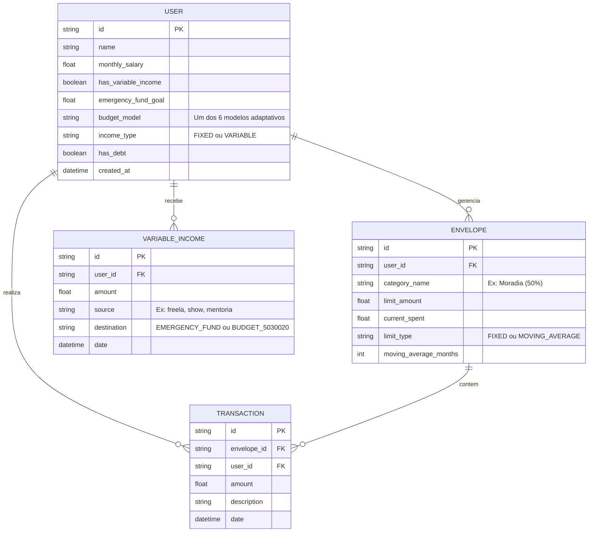
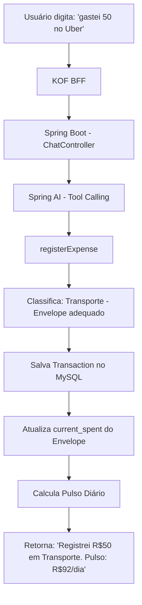
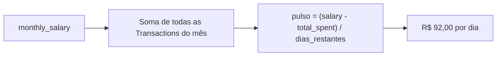
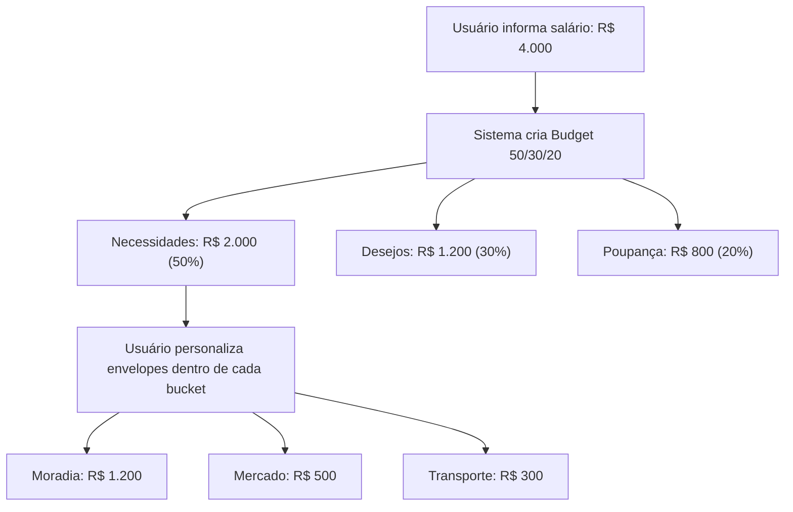
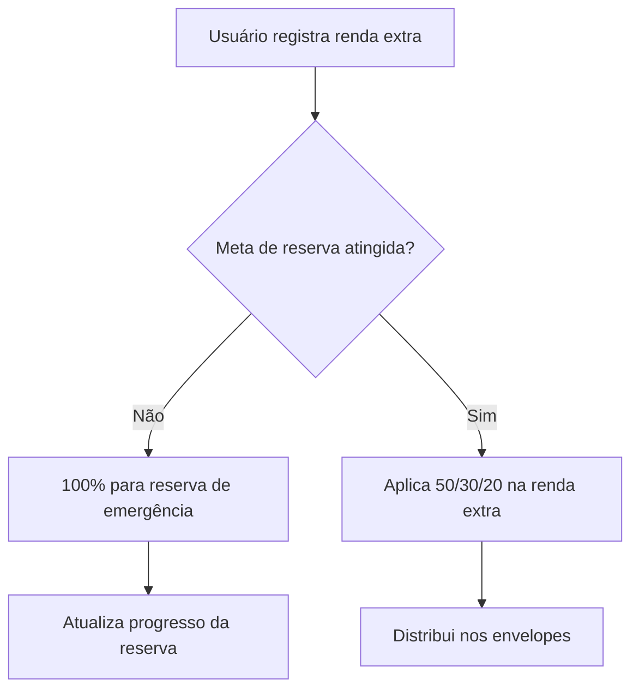
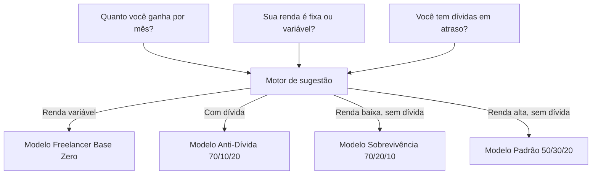

# Modelagem de Dados -- Organiza IA

## Decisões de simplificação

O modelo foi desenhado para facilitar a adoção pelo KOF e permitir que qualquer contribuidor entenda visualmente como os dados se relacionam no banco hospedado no Render.

Três entidades cobrem todo o domínio:

- **USER** é o centro. Tem salário mensal, que é a base de cálculo para tudo.
- **ENVELOPE** pertence ao User e representa um teto de gastos por categoria (ex: "Moradia -- 50%"). O campo `current_spent` é desnormalizado propositadamente para consulta rápida sem precisar agregar transações a cada request.
- **TRANSACTION** pertence ao User e opcionalmente a um Envelope. É o registro de cada gasto ou receita.

A simplicidade é intencional: um dev que olha o diagrama entende o sistema inteiro em 30 segundos.

---

## ER Diagram

---

## Fluxo principal: registro de gasto via chat

## Fluxo: cálculo do pulso diário

## Fluxo: criação automática de envelopes

## Fluxo: renda variável

## Fluxo: onboarding com sugestão de modelo

## Modelos de orçamento adaptativos

| Modelo | Percentuais / categorias | Público-alvo |
|---|---|---|
| **Padrão (STANDARD_503020)** | 50% Necessidades / 30% Desejos / 20% Futuro | Renda fixa acima de 2 salários mínimos, sem dívidas em atraso |
| **Sobrevivência (SURVIVAL_702010)** | 70% Necessidades / 20% Folga / 10% Guarda | Renda fixa até 2 salários mínimos (R$ 3.242), sem dívidas em atraso |
| **Anti-Dívida (ANTI_DEBT_701020)** | 70% Necessidades / 10% Pessoal / 20% Quitação de Dívida | Qualquer renda fixa, com dívidas em atraso |
| **Simplificado (SIMPLE_8020)** | 80% Viver / 20% Guardar | Quem quer simplicidade, sem categorizar cada gasto |
| **Kakeibo** | Essencial / Cultura / Lazer / Extras, com reflexão semanal | Quem quer refletir sobre os próprios hábitos de consumo |
| **Freelancer Base Zero** | Alocação por entrada (sem percentual fixo mensal) | Renda variável -- freelancer, PJ, artista |
